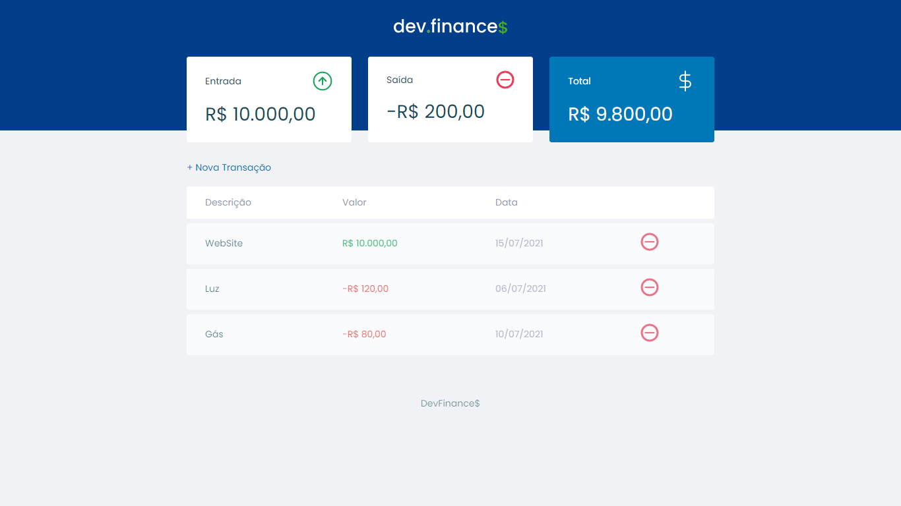

  

  

     

<h1 align="center">
    
</h1>

## 🧪 Tecnologias

Esse projeto foi desenvolvido com as seguintes tecnologias:

- HTML
- CSS
- JavaScript

## 🚀 Como executar

Abra o arquivo index.html em seu navegador de preferência, e explore o projeto.

## 💻 Projeto

DevFinances é um local para você organizar as suas despesas do dia a dia, e facilitar na hora de gerenciar quando dinheiro esta entrando e quanto está saindo.

## 📝 License

Esse projeto está sob a licença MIT. Veja o arquivo [LICENSE](LICENSE) para mais detalhes.

---

Feito com 💜 by [Pedro Leonrardo](https://github.com/xpedroleonardo)
